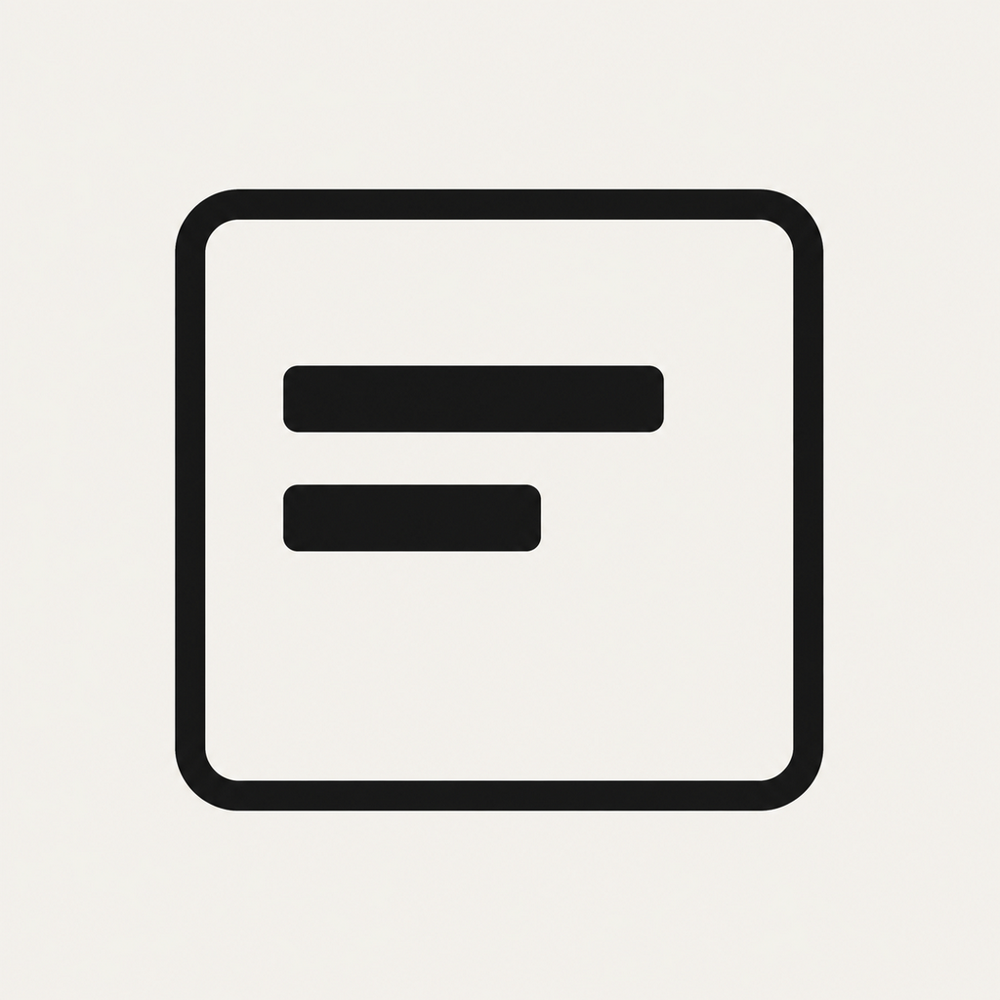
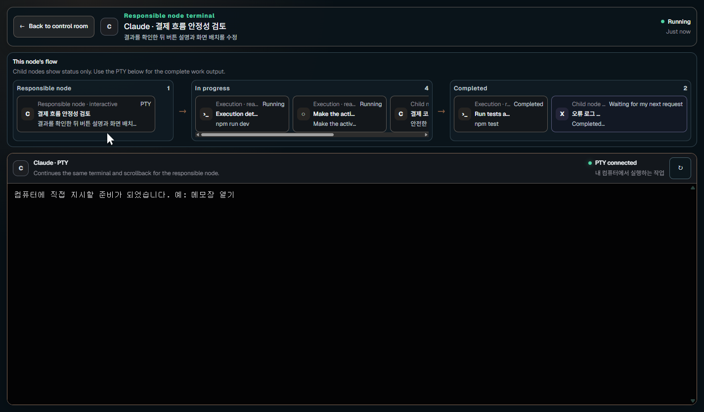

<div align="center">



# Whitebox

### See every AI agent at work—and step in when it needs you.

Monitor Claude, Codex, Gemini, and Grok sessions, follow parent–subagent relationships, inspect token usage, and send work back to a connected terminal—without uploading your transcripts.

[](https://github.com/minjund/Whitebox/actions/workflows/desktop-ci.yml)
[](https://www.npmjs.com/package/whitebox-ai)
[](https://github.com/minjund/Whitebox/releases/latest)


**English** | [简体中文](README.zh-CN.md) | [한국어](README.ko.md)

[**Download for Windows / macOS**](https://github.com/minjund/Whitebox/releases/latest) · [**Install with npm**](https://www.npmjs.com/package/whitebox-ai)

</div>

<div align="center">
  
</div>

> Your agent transcripts stay on your computer. Whitebox reads the local session files created by the AI tools you already use.

## Install and run

Choose npm if you already use Node.js, or download a ready-to-run desktop file. Neither option requires a Git checkout.

### Option 1: npm

Whitebox is published on npm as [`whitebox-ai`](https://www.npmjs.com/package/whitebox-ai). Install it globally, then run the shorter `whitebox` command to open the desktop dashboard:

```bash
npm install -g whitebox-ai
whitebox
```

The npm method does not create a desktop shortcut. Run `whitebox` whenever you want to open the app. If your terminal cannot find the command immediately after installation, close and reopen the terminal once.

```bash
# Update
npm install -g whitebox-ai@latest

# Remove
npm uninstall -g whitebox-ai
```

### Option 2: desktop download

Open the [latest GitHub Release](https://github.com/minjund/Whitebox/releases/latest) and download the file for your computer. Node.js is not required for these files.

| System | Download | Start the app |
|---|---|---|
| Windows 10/11 (x64) | `Whitebox-Setup-<version>.exe` | Recommended installer for first-time setup and in-app updates. |
| Windows 10/11 (x64) | `Whitebox-<version>-portable.exe` | Double-click the downloaded file. It is portable and does not run an installer. |
| Apple silicon Mac | `Whitebox-<version>-arm64.dmg` | Open the DMG, drag Whitebox into Applications, then open it from Applications. |
| Intel Mac | `Whitebox-<version>-x64.dmg` | Open the DMG, drag Whitebox into Applications, then open it from Applications. |

The current desktop files are not code-signed. Windows SmartScreen or macOS Gatekeeper may show an unknown-developer warning. Continue only when the file came from this repository's official Releases page. On macOS, Control-click Whitebox and choose **Open**. On Windows, choose **More info → Run anyway**.

### Update from the app

On startup, Whitebox compares its package version with the newest stable GitHub Release tag. When a newer version exists, a notice appears at the top of the app and under **Settings → Program update**. The app downloads the matching Windows Setup EXE or macOS DMG, verifies its GitHub file size and SHA-256 digest when available, and then lets you open the installer. npm installations can also use `npm install -g whitebox-ai@latest`.

### Requirements

- macOS or Windows
- Node.js 18 or newer only when installing through npm
- At least one installed and authenticated CLI: Claude Code, Codex CLI, Gemini CLI, or Grok CLI
- tmux for persistent AI sessions on macOS or managed WSL sessions on Windows. Native Windows AI sessions and ordinary shells keep using the direct PTY backend.

## Your first 10 minutes

1. From **Home**, choose `New AI task`, describe the outcome, and select a workspace. If no supported AI is installed, follow the official setup link shown in the app first.
2. Open **In progress** to see every AI with a green status. Expand `View detailed flow` only when you need the subagent breakdown.
3. When **Needs your input** shows a count, handle those replies or decisions first.
4. Open a task card or choose `Review complete` to enter the owning node's **exact PTY focus view**. Continue reading output and typing there.

The `10-minute start guide` on Home lets you practice the same four steps. Progress is saved on this computer and the guide can be reopened at any time.

### Continue in the owning node's real PTY

Starting a new AI task or opening a task or review request now enters a full PTY focus view instead of a right-side inspector or separate conversation screen. Whitebox opens only the existing PTY attached to that task's owning root node; it does not guess another terminal or silently create a replacement shell. Child work and execution units remain status-only in the header, while output, approvals, input, and scrollback stay in that same PTY.

## What Whitebox shows

| View | What you get |
|---|---|
| Agent map | Live work grouped by Claude, Codex, Gemini, and Grok |
| Relationship view | The request origin, selected agent, and every directly delegated subagent |
| Execution units | Foreground shells, background shells, and background jobs started by an AI, including command, workspace, execution ID, and live status |
| Operations and attention inbox | Blocking responses, optional follow-ups, and current failure, stall, or pause risks shown as separate categories |
| Management summary | Checkpoints, observation confidence, completion summary, artifacts, verification, and run controls |
| Token view | Input, output, cached, reasoning, total, and reported context-window usage |
| PTY focus view | The owning node's exact existing PTY and its downstream work status in one full-screen surface |

Whitebox distinguishes between a terminal it can control, a session that needs a bridge connection, a read-only session that must continue in its original app, and an ended session. It never types into an arbitrary external window.

## Use a connected terminal

Keep the Whitebox app open, then start an AI CLI through its authenticated local bridge:

```bash
whitebox run claude
whitebox run codex
whitebox run gemini
whitebox run grok
```

Arguments after `--` are passed to the provider CLI:

```bash
whitebox run claude -- --model claude-sonnet-4-6
```

The external terminal and Whitebox dashboard control the same Whitebox-owned session. Opening PTY from an AI card reuses the exact connected terminal in a full focus view instead of creating a new shell, and keeps its output and scrollback intact when the view is reopened. Sessions started arbitrarily elsewhere remain visible but read-only unless the original app exposes a supported handoff.

Persistent AI terminals on macOS and WSL run on the isolated `tmux -L whitebox` server, separate from your personal tmux server. `Close terminal view` detaches only the attached view while the AI keeps working in the background. `Reconnect existing work` attaches to that same tmux session and Whitebox session ID without starting another AI conversation. `End AI session` stops the tmux work but keeps its record for inspection; a stopped record can then be removed separately.

If the dashboard or terminal host exits unexpectedly, the next host reconnects to the same session when its tmux work is still alive. If the stored tmux session is gone, Whitebox marks the record stopped instead of silently starting a duplicate conversation. Native Windows AI sessions and ordinary shells retain the direct PTY/terminal-host backend. In both backends, running, detached, naturally exited, and failed-start records remain in Session terminal until explicitly removed.

## Local-first by design

- Session files are read directly from your user profile.
- API key files are not read or displayed; authentication stays with each provider CLI.
- The terminal bridge uses a per-user token and a local named pipe or Unix domain socket.
- Renderer requests are isolated and validated before terminal or tmux actions run.
- Enabling workspace writes gives the selected AI permission to modify that folder, so use it only with repositories you trust.

Review the visible transcript before sharing your screen: agent conversations and tool inputs can contain sensitive project information.

## Develop locally

```bash
npm install
npm start
npm test
```

Additional checks and distributable builds:

```bash
npm run test:terminal
npm run test:terminal:managed
npm run test:bridge
npm run test:tmux -- macOS
npm run test:visual
npm run dist:mac
npm run dist:win
```

`dist:mac` produces Apple Silicon and Intel DMG/ZIP files. `dist:win` produces Windows Setup and portable executables. Production macOS releases still require the maintainer's Apple signing and notarization credentials.

## Supported session sources

| Provider | Existing sessions | New work stream | Subagents |
|---|---|---|---|
| Claude | Claude Code local JSONL transcripts | Structured headless output | Transcript subagent records |
| Codex | Codex local rollout JSONL files | `codex exec --json` | `thread_spawn` parent metadata |
| Gemini | Gemini local chat JSON/JSONL files | Structured streaming output | Parent IDs when reported |
| Grok | Grok local session JSON/JSONL files | Structured streaming output | Parent IDs when reported |

Provider event mappings and context-window rules are documented in [Provider Contracts](docs/PROVIDER-CONTRACTS.md).

## Security and local data

The renderer is sandboxed. In-app updates verify a trusted GitHub Release URL
and SHA-256 digest, and production channels also require a valid platform
signature. The current internal channel permits unsigned Windows installers
and macOS DMGs only after the release URL, filename, size, and SHA-256 digest
checks; macOS removes quarantine only from the app being staged. Completed
managed runs and terminal history expire after 30 days by default. See the
[security policy](SECURITY.md), [threat model](docs/THREAT-MODEL.md), and
[data-retention policy](docs/DATA-RETENTION.md).

## Release

Pushing a `v*` Git tag validates the version, builds and verifies desktop artifacts, stages a draft release, publishes the npm package with provenance when enabled, and only then publishes the GitHub Release. The `package.json` version and tag must match. The current internal channel permits unsigned desktop artifacts; signing/notarization secrets and fail-closed checks must be restored before public production distribution.

Maintainer credentials and gates are documented in [Releasing](docs/RELEASING.md).

```bash
npm version patch --no-git-tag-version
git add package.json package-lock.json
VERSION=$(node -p 'require("./package.json").version')
git commit -m "release: v$VERSION"
git tag "v$VERSION"
git push origin HEAD --follow-tags
```

## License

Whitebox is available under the [MIT License](LICENSE).

---

<div align="center">
  Built for people who run more than one AI agent—and still want to know exactly what each one is doing.
</div>
