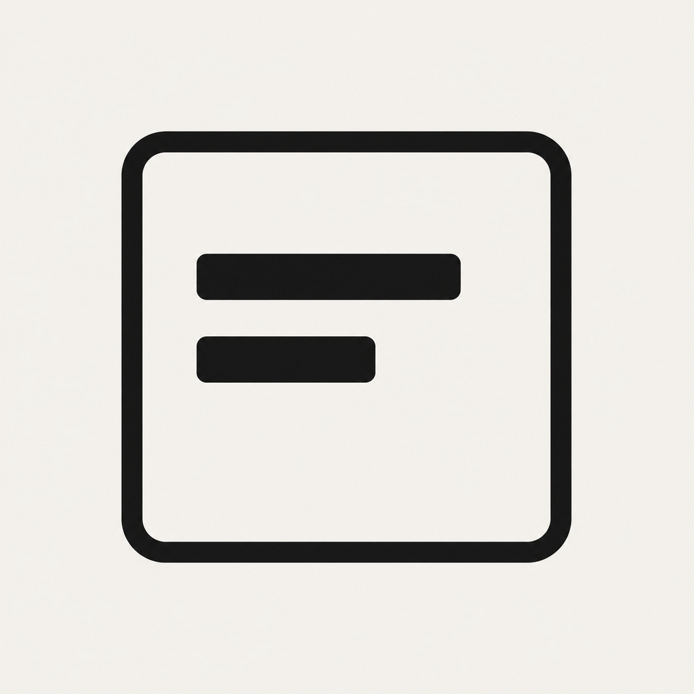
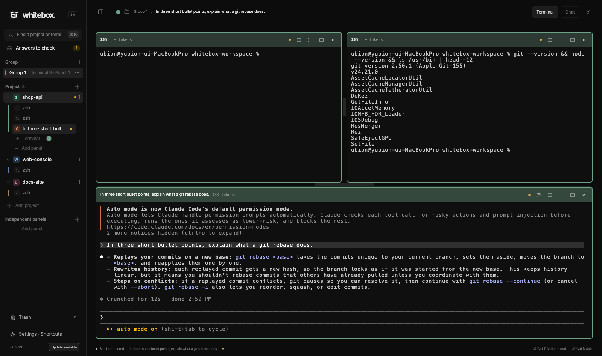
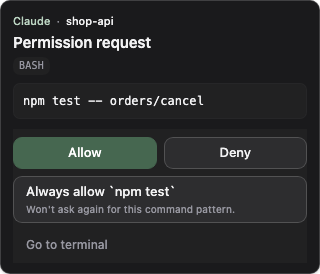
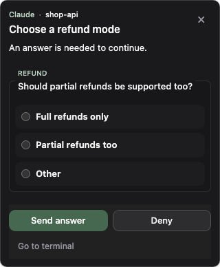
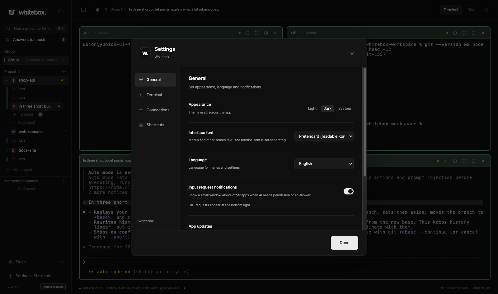

<p align="center">
  
</p>

<h1 align="center">Whitebox</h1>

<p align="center">
  <b>Run several AI agents side by side in real terminals,<br>and see at a glance which one is working, waiting or has an answer to check.</b>
</p>

<p align="center">
  <a href="https://github.com/minjund/Whitebox/releases/latest"></a>
  <a href="https://github.com/minjund/Whitebox/releases"></a>
  
  <a href="https://www.npmjs.com/package/whitebox-ai"></a>
  <a href="LICENSE"></a>
</p>

<p align="center">
  <b>English</b> · <a href="README.ko.md">한국어</a> · <a href="README.zh-CN.md">简体中文</a>
</p>

<p align="center">
  <a href="#install"><b>Install</b></a> ·
  <a href="#quick-start">Quick start</a> ·
  <a href="#features">Features</a> ·
  <a href="#whitebox-cli">CLI</a> ·
  <a href="#development">Development</a>
</p>

<p align="center">
  
</p>

## What is Whitebox?

With several AI CLIs such as Claude Code and Codex open at once, it is easy to lose track of which terminal is doing what and which one has finished or is waiting for you. Whitebox keeps those terminals organised in panels per project and shows at a glance **which terminal is working, which is waiting for input and which has a reply you have not checked yet**.

- **Your terminal stays your terminal.** Run the CLIs you already use inside Whitebox terminals. No agent framework or prompt format required.
- **Status at a glance.** The sidebar marks each terminal as working, waiting or with a reply to check, and a Claude or Codex terminal can also be read as a chat, so parallel agents never get mixed up.
- **A local desktop app.** Terminal output, requests and records stay on your machine. See [Data and privacy](#data-and-privacy).

## Install

### Windows 10/11 (x64)

Download `Whitebox-Setup-*.exe` from [Releases](https://github.com/minjund/Whitebox/releases/latest) and run it. In the NSIS installer, choose to install for the current user only; it installs into your user profile and needs no administrator rights. You can also change the install folder. Later updates are installed from inside the app (Settings → General). To run without installing, download `Whitebox-*-portable.exe`.

When the app updates itself, it verifies the downloaded file against the size and SHA-256 recorded in the GitHub release, but the Windows installer is not Authenticode-signed yet. If you download it in a browser, Microsoft Defender SmartScreen may warn about an unknown publisher. Make sure the file came from the official [minjund/Whitebox Releases](https://github.com/minjund/Whitebox/releases) URL, then choose **More info → Run anyway**.

### macOS

#### Install script

```sh
curl -fsSL https://raw.githubusercontent.com/minjund/Whitebox/main/scripts/install-macos.sh | bash
```

Downloads the DMG for your Mac (`arm64` for Apple Silicon, `x64` for Intel) from the latest release, checks it against the size and SHA-256 recorded in the release, copies it to `/Applications/Whitebox.app` and removes the quarantine attribute. Set `WHITEBOX_INSTALL_DIR` to install elsewhere:

```sh
curl -fsSL https://raw.githubusercontent.com/minjund/Whitebox/main/scripts/install-macos.sh \
  | WHITEBOX_INSTALL_DIR="$HOME/Applications" bash
```

#### Manual DMG

Download `Whitebox-*-arm64.dmg` (Apple Silicon) or `Whitebox-*-x64.dmg` (Intel) from [Releases](https://github.com/minjund/Whitebox/releases/latest), copy the app to Applications, then remove the quarantine attribute:

```sh
xattr -dr com.apple.quarantine /Applications/Whitebox.app
```

Whitebox is an ad-hoc signed build, not signed or notarized with an Apple Developer ID. The command above only removes Gatekeeper's quarantine flag; it does not change the app.

### npm launcher

With Node.js 18 or newer you can install from npm and open the app with the `whitebox` command.

```sh
npm install -g whitebox-ai
whitebox
```

### Prerequisites

Whitebox does not install AI CLIs for you. Install and sign in to the CLIs you want to use first, such as [Claude Code](https://docs.anthropic.com/en/docs/claude-code) or [Codex CLI](https://github.com/openai/codex).

## Quick start

1. Click **Add project** in the left sidebar and pick a folder.
2. Click **Add panel** to open a terminal in that folder.
3. Run `claude` or `codex` and ask as usual.
4. Add another **Terminal** to the panel, or split with <kbd>⌘/Ctrl</kbd>+<kbd>D</kbd>, to run another agent alongside.
5. When a reply finishes, the terminal gets a yellow dot in the sidebar. Click **Answers to check** at the top of the sidebar to open each terminal with an unread reply in turn.

| Shortcut | Action |
| --- | --- |
| <kbd>⌘/Ctrl</kbd>+<kbd>T</kbd> | Add terminal |
| <kbd>⌘/Ctrl</kbd>+<kbd>D</kbd> | Split |
| <kbd>⌘/Ctrl</kbd>+<kbd>K</kbd> | Find a project |

## Features

### Projects, panels and split terminals

- Each project has panels, and each panel splits its terminals into an aligned grid. Drag terminals to view them together with terminals from other panels.
- The sidebar tells working terminals apart from those waiting for input or approval and those with a reply you have not read yet. Long-running background commands and monitors get their own badges. **Answers to check** at the top of the sidebar counts the terminals with an unread AI reply and opens them one by one.
- A terminal is named after your latest request, so you can tell many of them apart at a glance. The request is recorded on this computer; no AI call is made.
- Terminal sessions and output survive resizing, panel switches and app restarts. Korean and other IME input is supported.
- Moving a terminal to the trash stops its session and frees its slot. Output and records are kept and can be restored read-only; deleting permanently removes them.

### Chat view

Read a Claude or Codex terminal as a chat inside its own pane, and send the next request from the chat input to the same AI session. **Terminal / Chat** at the top switches every Claude/Codex terminal on screen at once; the chat button in a pane header switches just that pane. Each terminal remembers its view.

- The bubbles come from that terminal's own conversation log on this computer; no extra AI call is made. Tool calls are folded into one line and thinking is not shown.
- The terminal keeps running underneath with its size unchanged, and the pane stays in the split with the others.
- A message sent while the AI is working, while the terminal has unsent text or while it asks a question waits in the chat and goes when the AI is ready. It is never resent after a restart.
- When the AI asks a question in the terminal, the chat says so; **Show terminal** opens the terminal to answer it.

### Question and approval popups

<p align="center">
  
  &nbsp;&nbsp;
  
</p>

When an AI asks for permission to run a command or needs an answer, a small window appears at the bottom right even while you work in another app. Allow, deny or pick an answer there; several questions are paged. A response is delivered only after it is matched to the original terminal and request.

### Terminals working together

An AI inside a Whitebox terminal can use the `whitebox` CLI or the panel MCP tools to open more AI terminals in the same panel, send requests to other terminals and wait for their replies. Inside Whitebox terminals, commands that open tmux or external terminal apps are blocked and pointed to the Whitebox tools.

### Settings

<p align="center">
  
</p>

Settings has **General** (theme, language, input request alerts, app updates), **Terminal** (font, size), **Connections** (Codex · Claude CLI) and **Shortcuts**. The interface is available in 한국어, English and 简体中文. The app checks for new versions at startup and every 15 minutes.

## whitebox CLI

The `whitebox` command, from the npm launcher or bundled with the app, controls the app and its terminals.

```sh
whitebox                                        # open the desktop app
whitebox run claude                             # run an AI through the app bridge (claude | codex | gemini | grok)
whitebox new-terminal codex --count 3           # open 3 AI terminals in the same panel
whitebox list-panels                            # list terminals in the same panel
whitebox ask codex "find why the test fails"    # send a request to another terminal
whitebox wait <job-id>                          # wait for that request's actual reply
whitebox read-screen --surface <terminal-id>    # read a terminal's output
```

Run `whitebox --help` for every command. `run` and the panel commands need the Whitebox app to be open.

## Data and privacy

- Terminal output, requests and records are stored only on your machine. Finished records are removed after 30 days by default; see [Data retention](docs/DATA-RETENTION.md) to change that.
- Whitebox does not send your requests or terminal output to an AI model for analysis. The AI CLIs you run in its terminals talk to their own services as they normally do.
- Report security issues as described in [SECURITY.md](SECURITY.md).

## Development

You need Node.js 22 or newer and your platform's build tools for `node-pty` (Xcode Command Line Tools on macOS, Visual Studio Build Tools on Windows).

```sh
git clone https://github.com/minjund/Whitebox.git
cd Whitebox
npm ci
npm start
```

Main checks:

```sh
npm run check:source      # source rules
npm test                  # regression tests
npm run test:workspace    # workspace UI and terminal integration
npm run test:terminal     # terminal engine and PTY
```

See [ARCHITECTURE.md](docs/ARCHITECTURE.md) for the structure, [terminal-workspace.md](docs/terminal-workspace.md) for workspace behavior and [RELEASING.md](docs/RELEASING.md) for releases. Read [CONTRIBUTING.md](CONTRIBUTING.md) before opening a pull request.

## License

Whitebox is available under the [MIT License](LICENSE). Icon provenance and notices are in [ICON-LICENSE.md](docs/ICON-LICENSE.md).

---

<p align="center">
  Built for people who run more than one AI agent and still want to know exactly what each one is doing.
</p>
